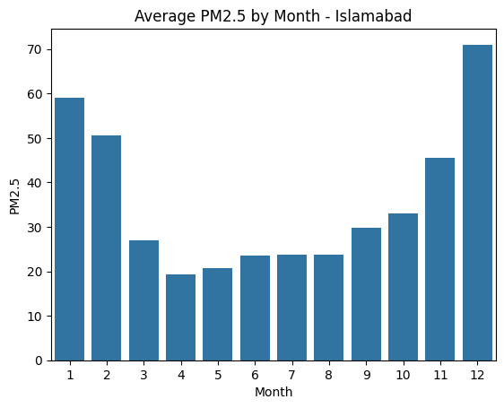
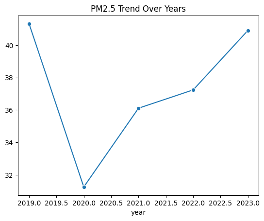
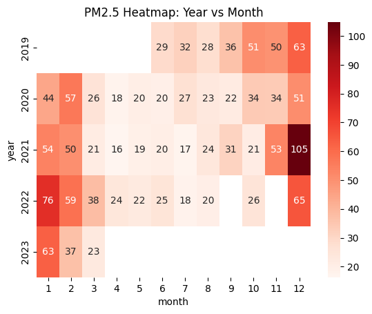

# Islamabad Air Quality Analysis (2019–2023)

Lahore usually gets all the headlines for Pakistan's smog problem — so I decided to look at what the data actually says about Islamabad instead, using ~4 years of real air quality readings.

## Problem Statement

Islamabad's air quality data exists in scattered, inconsistently-formatted monthly CSV files with messy date formats, typos in filenames, duplicate/overlapping months across files, and mislabeled years. Before any analysis was possible, this data needed serious cleaning. This project documents that cleaning process and the resulting insights.

## Dataset

- ~45 monthly CSV files (2019–2023), each containing daily readings of Temperature, Humidity, NO2, SO2, and PM2.5.
- No city column — this dataset covers **Islamabad only**.
- No pre-built AQI column — **PM2.5** (µg/m³) is used as the primary pollution indicator throughout this analysis, since it's the most commonly referenced pollutant for smog severity.

## Data Cleaning — What Was Actually Wrong

Real government/scraped data rarely comes clean. Here's what this dataset needed:

- **Inconsistent date formats** across files — e.g. `"1 - Jan"`, `"1Jan"`, `"17Jun19"` all appeared, sometimes with a year embedded, sometimes without. Solved with regex extraction of day/month, then reconstructed using each file's source year.
- **Mislabeled year in filename**: `AQR20augsut202022.csv` (note the typo "augsut") was being parsed as 2020 due to an ambiguous filename pattern; manually corrected to 2022 based on surrounding file naming conventions.
- **Duplicate/overlapping months**: several months appeared in more than one file with conflicting values (e.g. three different files all claimed data for March 22, 2020). Resolved by keeping the first occurrence per date — a simplification worth noting as a limitation.
- **Missing values**: 2 missing Temperature/Humidity readings, filled with the column median.
- **Outlier check**: no extreme sensor-error values found (e.g. no PM2.5 readings in the thousands). One notably high month (Dec 2021, avg PM2.5 ~105) was investigated rather than dropped — see Key Findings.

## Key Findings

- **December is by far the worst month** for air quality (avg PM2.5 ≈ 71 µg/m³), followed by January (≈59) and February (≈51).
- **Winter pollution is more than double summer's** — 57.6 vs 25.3 average PM2.5. This lines up with the well-known crop-burning + temperature inversion smog season across Punjab and the wider region.
- **Weekday vs weekend pollution is nearly identical** (36.4 vs 35.8) — a surprising result. Unlike traffic-driven pollution seen in many major cities, Islamabad's smog appears to be driven more by seasonal/weather factors than by weekday commuter traffic.
- **Pollution dropped sharply in 2020** (COVID lockdown year, avg ≈31), but has climbed back up every year since, reaching ≈41 in 2023 — close to pre-pandemic 2019 levels (≈41). The improvement from lockdowns was temporary.

## Visualizations

| Monthly Average PM2.5 | Year-over-Year Trend | Year × Month Heatmap |
|---|---|---|
|  |  |  |

## How to Run

1. Place all raw monthly CSV files in the project folder.
2. Run `Final_data.py`.
3. Outputs: `islamabad_air_quality_cleaned.csv` (cleaned dataset) + 3 PNG charts.

```bash
python Final_data.py
```

## Tools Used

Python, Pandas, Matplotlib, Seaborn

## Limitations / Honest Notes

- Duplicate-date conflicts were resolved by simply keeping the first file encountered — not a value-by-value verification. A production pipeline would cross-check sensor sources.
- No official AQI conversion was applied — raw PM2.5 concentration was used directly as the pollution indicator.
- Dataset covers Islamabad only; no cross-city comparison was possible with this data.
